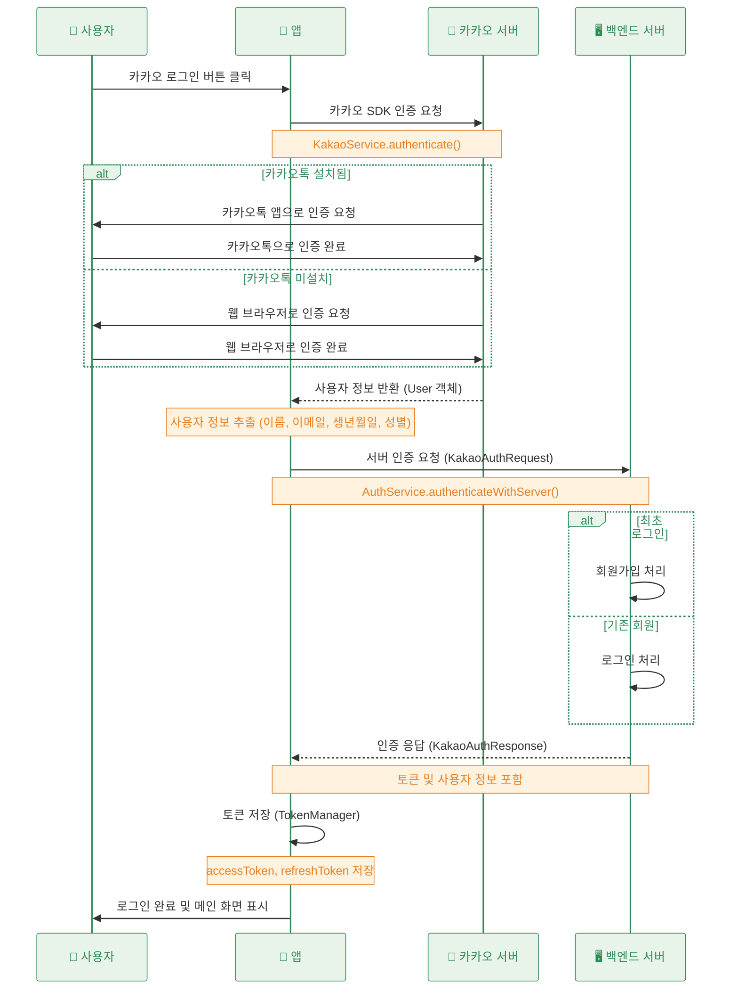

## 설계

카카오로그인을 이용하여 사용자가 아이디, 비밀번호를 입력할 필요 없이 회원가입/로그인을 수행한다



## 플랫폼 등록

자신이 사용할 플랫폼을 등록한다

우선 안드로이드로만 등록했다

`내 애플리케이션 → 앱 설정 → 플랫폼`


등록 후 모습

키 해시는 개발용에서는 디버그용 키만 입력해도 충분하다고 한다


## 앱 키 설정

kakao developers에 등록한 내 어플리케이션의 앱 키를 확인해야 한다 

`내 애플리케이션 → 앱 설정 → 앱 키`


flutter에서는 dotenv 라이브러리를 이용해서 키를 관리하였다


안드로이드에서도 .env 안의 값을 가져와서 사용하고 싶었지만 실패했다

그래서 우선 properties에 추가로 작성하고, app 수준의 build.gradle에서 읽어와서 사용하도록 했다

`android\local.properties`


`android\app\build.gradle.kts`

```kotlin
import com.android.build.gradle.internal.cxx.configure.gradleLocalProperties // 추가
// ...

android {
    // ... 

    defaultConfig {
        minSdk = flutter.minSdkVersion
        targetSdk = flutter.targetSdkVersion
        versionCode = flutter.versionCode
        versionName = flutter.versionName
        
        // ...
        
        // kakao app key 설정
        val properties = gradleLocalProperties(rootProject.projectDir, providers)
        manifestPlaceholders["KAKAO_APP_KEY"] = properties.getProperty("kakao.app.key", "")
    }
    // ...
}
```


위에서 등록한 `KAKAO_APP_KEY`를 이용하여 **커스텀 URL 스킴**을 설정한다

`android\app\src\main\AndroidManifest.xml`


## 동의항목 설정

카카오인증을통해 가져올 정보들의 권한 동의 설정을 한다

여기서 동의한 항목을 나중에 `kakaoAccount.name` 처럼 가져와서 사용할 수 있다


## Flutter 구현

1. kakao sdk 설치
    
    ```kotlin
    flutter pub add kakao_flutter_sdk_user
    ```
    

2. main() 초기화 로직 구현
    
    앱 키를 가져와서 nativeAppKey 파라미터로 전달해준다
    
    ```dart
    Future<void> main() async {
      WidgetsFlutterBinding.ensureInitialized();
    
      // .env 파일 로드
      await dotenv.load(fileName: ".env");
      // kakao sdk 초기화
      KakaoSdk.init(nativeAppKey: dotenv.env['KAKAO_APP_KEY'] ?? '');
    
      runApp(const ProviderScope(child: MyApp()));
    }
    ```
    

3. 서비스 구현
    
    카카오톡 설치 유무에 따라 `loginWithKakaoTalk` 와 `loginWithKakaoAccount` 로 분리하여 인증을 수행한다
    
    ```dart
    import 'package:flutter_riverpod/flutter_riverpod.dart';
    import 'package:kakao_flutter_sdk_user/kakao_flutter_sdk_user.dart';
    
    class KakaoService {
      /// 카카오 SDK를 통한 인증
      Future<User> authenticate() async {
        try {
          final installed = await isKakaoTalkInstalled();
          if (installed) {
            await UserApi.instance.loginWithKakaoTalk();
          } else {
            await UserApi.instance.loginWithKakaoAccount();
          }
    
          return await UserApi.instance.me();
        } catch (error) {
          print('카카오 인증 실패: $error');
          throw Exception('카카오 인증 실패: $error');
        }
      }
    
      /// 카카오 로그아웃
      Future<void> logout() async {
        try {
          await UserApi.instance.logout();
        } catch (error) {
          print('카카오 로그아웃 실패: $error');
          throw Exception('카카오 로그아웃 실패: $error');
        }
      }
    }
    
    final kakaoServiceProvider = Provider<KakaoService>((ref) {
      return KakaoService();
    });
    
    ```
    

4. 사용자 정보를 통한 서버 인증
    1. 카카오 로그인 수행
    2. 카카오 계정에서 동의 항목으로 설정한 정보(`kakaoUser.kakaoAccount?.name` 등) 추출
    3. 서버 인증 수행
    
    ```dart
    /// 서버 로그인/회원가입
    Future<KakaoAuthResponse> authenticateWithServer(User kakaoUser) async {
      try {
        final request = KakaoAuthRequest(
          name: kakaoUser.kakaoAccount?.name ?? '',
          email: kakaoUser.kakaoAccount?.email ?? '',
          birthyear: kakaoUser.kakaoAccount?.birthyear ?? '',
          birthday: kakaoUser.kakaoAccount?.birthday ?? '',
          gender: kakaoUser.kakaoAccount?.gender?.toString().toLowerCase() ?? '',
          providerId: kakaoUser.id.toString(),
        );
    		
    		// 서버 인증 요청
        return await _authRepository.signInWithKakao(request);
      } catch (error) {
        print('서버 인증 실패: $error');
        throw Exception('서버 인증 실패: $error');
      }
    }
    
    /// 통합 로그인 프로세스
    Future<KakaoAuthResponse> signInWithKakao() async {
      try {
        // 카카오 인증
        final kakaoUser = await _kakaoService.authenticate();
    
        // 서버 인증
        return await authenticateWithServer(kakaoUser);
      } catch (error) {
        print('로그인 프로세스 실패: $error');
        throw Exception('로그인 프로세스 실패: $error');
      }
    }
    ```
    

- 처음 로그인 시 권한 요청 화면


- 다시 로그인하면 바로 로그인이 가능하다


## reference

1. [https://developers.kakao.com/docs/latest/ko/kakaologin/flutter](https://developers.kakao.com/docs/latest/ko/kakaologin/flutter) 
2. [https://velog.io/@iamjm29/Android-키해시key-hash-추출하기](https://velog.io/@iamjm29/Android-%ED%82%A4%ED%95%B4%EC%8B%9Ckey-hash-%EC%B6%94%EC%B6%9C%ED%95%98%EA%B8%B0)
