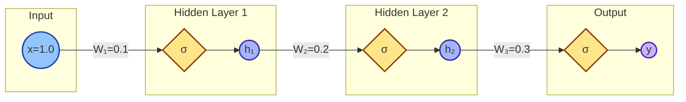

## Problem of Sigmoid

인공지능 학습 과정

1. 입력 데이터에 가중치와 편향 적용
2. 활성화 함수를 통해 예측 값 계산
3. 예측 값과 실제 값(Ground Truth) 간의 오차를 손실 함수로 계산하여 모델의 성능을 평가
4. 역전파로 그래디언트 계산
5. 경사 하강법으로 가중치 업데이트

문제점 : 활성화 함수으로 Sigmoid를 사용하면 Vanishing Gradient가 발생

Vanishing Gradient : 역전파 과정 중 그래디언트가 점점 작아져서, 초기 층들의 가중치가 거의 업데이트되지 않는 문제로 학습이 어려워지는 현상


복잡한 네트워크에서는 레이어의 앞부분에는 gradient를 전달할 수 없게 됨


 

- 간단한 3층 신경망 예시
    
    각 층에 Sigmoid 활성화 함수를 사용한 간단한 신경망
    
    - 입력 데이터: `x = 1.0`
    - 첫 번째 레이어 가중치: `W1 = 0.1`
    - 두 번째 레이어 가중치: `W2 = 0.2`
    - 세 번째 레이어 가중치: `W3 = 0.3`
    


    ### Forward Pass 계산
    
    1. **첫 번째 레이어 출력**
        - `z1 = W1 * x = 0.1 * 1.0 = 0.1`
        - `a1 = sigmoid(z1) = 1 / (1 + e^(-0.1)) ≈ 0.525`
    2. **두 번째 레이어 출력**
        - `z2 = W2 * a1 = 0.2 * 0.525 ≈ 0.105`
        - `a2 = sigmoid(z2) = 1 / (1 + e^(-0.105)) ≈ 0.526`
    3. **세 번째 레이어 출력**
        - `z3 = W3 * a2 = 0.3 * 0.526 ≈ 0.158`
        - `a3 = sigmoid(z3) = 1 / (1 + e^(-0.158)) ≈ 0.539`
    
    ---
    
    ### Backward Pass: 그래디언트 계산
    
    Sigmoid 함수의 미분 값
    
    $\sigma'(x) = \sigma(x)(1 - \sigma(x))$
    
    4. **세 번째 레이어의 그래디언트**
        - `σ'(z3) = 0.539 * (1 - 0.539) ≈ 0.248`
    5. **두 번째 레이어의 그래디언트**
        - `σ'(z2) = 0.526 * (1 - 0.526) ≈ 0.249`
        - 전달된 그래디언트: `0.248 * 0.249 ≈ 0.061`
    6. **첫 번째 레이어의 그래디언트**
        - `σ'(z1) = 0.525 * (1 - 0.525) ≈ 0.249`
        - 전달된 그래디언트: `0.061 * 0.249 ≈ 0.015`
    
    ---
    
    ### 결과
    
    - 각 층을 거칠 때마다 그래디언트가 점점 작아지며, 첫 번째 레이어에서는 그래디언트가 약 `0.015`로 매우 작아짐
    - 이로 인해 첫 번째 레이어의 가중치 업데이트가 거의 이루어지지 않아 **Vanishing Gradient** 문제가 발생

---

## Relu

$$
f(x)=max(0,x)
$$

- 동작 방식 : x가 0보다 클 경우 x를 그대로 출력하고, 0보다 작을 경우 0으로 출력
- 장점 : 파란색 구역에서 그라디언트를 계산하여 Vanishing Gradient 를 해결
- 단점 : 음수 영역에서 그라디언트가 0이 되는 단점이 있어, 특정 상황에서 문제(Dying ReLU)가 발생할 수 있다

Dying ReLU : 뉴런의 입력값이 음수로 계속 유지될 때 해당 뉴런의 출력이 0이 되어, 그 이후로 그 뉴런이 학습되지 않는 현상


pytorch에서 사용법

```python
x = torch.nn.relu(x)
x = torch.nn.leaky_relu(x, 0.01) # 음의 값에 0 대신 0.01의 작은 기울기를 적용
```

## Optimizer in PyTorch

pytorch Optimizer 종류

```python
torch.optim.SGD        # 확률적 경사 하강법(Stochastic Gradient Descent), 가장 기본적인 경사 하강법 알고리즘.
torch.optim.Adadelta   # Adadelta는 적응적 학습률을 사용하여, 학습률을 자동으로 조정하는 알고리즘.
torch.optim.Adagrad    # Adagrad는 매개변수마다 학습률을 조정하여 드물게 나타나는 피처를 더 학습하도록 돕는 알고리즘.
torch.optim.Adam       # Adam(Adaptive Moment Estimation)은 모멘텀과 RMSprop의 장점을 결합한 알고리즘으로, 가장 많이 사용됨.
torch.optim.SparseAdam # 희소한 매개변수에 적합한 Adam의 변형으로, NLP와 같은 희소 데이터에 유용함.
torch.optim.ASGD       # 평균화된 SGD(ASGD)는 SGD의 변형으로, 일반 SGD보다 더 안정적인 수렴성을 제공함.
torch.optim.LBFGS      # 제한된 메모리 BFGS(LBFGS)는 2차 도함수를 사용하는 최적화 기법으로, 매우 작은 배치에서 동작함.
torch.optim.RMSprop    # RMSprop은 Adagrad의 학습률 감소 문제를 해결한 알고리즘으로, 최근 그래디언트를 고려함.
torch.optim.Rprop      # Rprop(Resilient Backpropagation)은 각 매개변수의 크기와 무관하게 업데이트 방향만을 고려하는 방법.
```

[https://www.denizyuret.com/2015/03/alec-radfords-animations-for.html](https://www.denizyuret.com/2015/03/alec-radfords-animations-for.html)

각 옵티마이저들이 학습을 진행하면서 어떤 방식으로 수렴하는지를 보여줌


각 옵티마이저 발달계보

[https://www.slideshare.net/slideshow/ss-79607172/79607172#49](https://www.slideshare.net/slideshow/ss-79607172/79607172#49)


## Code : mnist_softmax

```python
import torch
import torchvision.datasets as dsets
import torchvision.transforms as transforms
import matplotlib.pyplot as plt
import random
device = 'cuda' if torch.cuda.is_available() else 'cpu'

# for reproducibility
random.seed(777)
torch.manual_seed(777)
if device == 'cuda':
    torch.cuda.manual_seed_all(777)
# parameters
learning_rate = 0.001
training_epochs = 15
batch_size = 100
# MNIST dataset
# 문제 1.
# 서버 다운로드 403 오류
# !wget www.di.ens.fr/~lelarge/MNIST.tar.gz
# !tar -zxvf MNIST.tar.gz
# MNIST 직접추가
# 문제 2.
# MNIST_data/MNIST/processed/training.pt is a zip archive (did you mean to use torch.jit.load()?)'
# pip install --upgrade torch
mnist_train = dsets.MNIST(root='MNIST_data/',
                          train=True,
                          transform=transforms.ToTensor(),
                          download=True)

mnist_test = dsets.MNIST(root='MNIST_data/',
                         train=False,
                         transform=transforms.ToTensor(),
                         download=True)
# dataset loader
data_loader = torch.utils.data.DataLoader(dataset=mnist_train,
                                          batch_size=batch_size,
                                          shuffle=True,
                                          drop_last=True)
# MNIST data image of shape 28 * 28 = 784
linear = torch.nn.Linear(784, 10, bias=True).to(device)
# Initialization
torch.nn.init.normal_(linear.weight)

# define cost/loss & optimizer
criterion = torch.nn.CrossEntropyLoss().to(device)    # Softmax is internally computed.
optimizer = torch.optim.Adam(linear.parameters(), lr=learning_rate)
total_batch = len(data_loader)
for epoch in range(training_epochs):
    avg_cost = 0

    for X, Y in data_loader:
        # reshape input image into [batch_size by 784]
        # label is not one-hot encoded
        X = X.view(-1, 28 * 28).to(device)
        Y = Y.to(device)

        optimizer.zero_grad()
        hypothesis = linear(X)
        cost = criterion(hypothesis, Y)
        cost.backward()
        optimizer.step()

        avg_cost += cost / total_batch

    print('Epoch:', '%04d' % (epoch + 1), 'cost =', '{:.9f}'.format(avg_cost))

print('Learning finished')
# Epoch: 0001 cost = 5.728240490
# Epoch: 0002 cost = 1.562848449
# Epoch: 0003 cost = 1.036820769
# Epoch: 0004 cost = 0.828017235
# Epoch: 0005 cost = 0.710269213
# Epoch: 0006 cost = 0.633605897
# Epoch: 0007 cost = 0.577520072
# Epoch: 0008 cost = 0.535485566
# Epoch: 0009 cost = 0.502551138
# Epoch: 0010 cost = 0.476104528
# Epoch: 0011 cost = 0.453757524
# Epoch: 0012 cost = 0.435718447
# Epoch: 0013 cost = 0.420195490
# Epoch: 0014 cost = 0.406820983
# Epoch: 0015 cost = 0.394985646
# Learning finished

# Test the model using test sets
with torch.no_grad():
    X_test = mnist_test.test_data.view(-1, 28 * 28).float().to(device)
    Y_test = mnist_test.test_labels.to(device)

    prediction = linear(X_test)
    correct_prediction = torch.argmax(prediction, 1) == Y_test
    accuracy = correct_prediction.float().mean()
    print('Accuracy:', accuracy.item())

    # Get one and predict
    r = random.randint(0, len(mnist_test) - 1)
    X_single_data = mnist_test.test_data[r:r + 1].view(-1, 28 * 28).float().to(device)
    Y_single_data = mnist_test.test_labels[r:r + 1].to(device)

    print('Label: ', Y_single_data.item())
    single_prediction = linear(X_single_data)
    print('Prediction: ', torch.argmax(single_prediction, 1).item())
# Accuracy: 0.891700029373169
# Label:  8
# Prediction:  3
```

Adam을 optimizer 로 이용함

## Code : mnist_nn

```python
import torch
import torchvision.datasets as dsets
import torchvision.transforms as transforms
import matplotlib.pyplot as plt
import random
device = 'cuda' if torch.cuda.is_available() else 'cpu'

# for reproducibility
random.seed(777)
torch.manual_seed(777)
if device == 'cuda':
    torch.cuda.manual_seed_all(777)
# parameters
learning_rate = 0.001
training_epochs = 15
batch_size = 100
# MNIST dataset
# 문제 1.
# 서버 다운로드 403 오류
# !wget www.di.ens.fr/~lelarge/MNIST.tar.gz
# !tar -zxvf MNIST.tar.gz
# MNIST 직접추가
# 문제 2.
# MNIST_data/MNIST/processed/training.pt is a zip archive (did you mean to use torch.jit.load()?)'
# pip install --upgrade torch
mnist_train = dsets.MNIST(root='MNIST_data/',
                          train=True,
                          transform=transforms.ToTensor(),
                          download=True)

mnist_test = dsets.MNIST(root='MNIST_data/',
                         train=False,
                         transform=transforms.ToTensor(),
                         download=True)
# dataset loader
data_loader = torch.utils.data.DataLoader(dataset=mnist_train,
                                          batch_size=batch_size,
                                          shuffle=True,
                                          drop_last=True)
# nn layers
linear1 = torch.nn.Linear(784, 256, bias=True)
linear2 = torch.nn.Linear(256, 256, bias=True)
linear3 = torch.nn.Linear(256, 10, bias=True)
relu = torch.nn.ReLU()
# Initialization
torch.nn.init.normal_(linear1.weight)
torch.nn.init.normal_(linear2.weight)
torch.nn.init.normal_(linear3.weight)
# model
model = torch.nn.Sequential(linear1, relu, linear2, relu, linear3).to(device)
# define cost/loss & optimizer
criterion = torch.nn.CrossEntropyLoss().to(device)    # Softmax is internally computed.
optimizer = torch.optim.Adam(model.parameters(), lr=learning_rate)
total_batch = len(data_loader)
for epoch in range(training_epochs):
    avg_cost = 0

    for X, Y in data_loader:
        # reshape input image into [batch_size by 784]
        # label is not one-hot encoded
        X = X.view(-1, 28 * 28).to(device)
        Y = Y.to(device)

        optimizer.zero_grad()
        hypothesis = model(X)
        cost = criterion(hypothesis, Y)
        cost.backward()
        optimizer.step()

        avg_cost += cost / total_batch

    print('Epoch:', '%04d' % (epoch + 1), 'cost =', '{:.9f}'.format(avg_cost))

print('Learning finished')
# Epoch: 0001 cost = 128.861633301
# Epoch: 0002 cost = 35.946983337
# Epoch: 0003 cost = 22.999927521
# Epoch: 0004 cost = 16.049583435
# Epoch: 0005 cost = 11.660148621
# Epoch: 0006 cost = 8.545135498
# Epoch: 0007 cost = 6.511620045
# Epoch: 0008 cost = 4.907732010
# Epoch: 0009 cost = 3.620804548
# Epoch: 0010 cost = 2.742984056
# Epoch: 0011 cost = 2.156677008
# Epoch: 0012 cost = 1.695149422
# Epoch: 0013 cost = 1.215091109
# Epoch: 0014 cost = 1.029857874
# Epoch: 0015 cost = 0.871816397
# Learning finished

# Test the model using test sets
with torch.no_grad():
    X_test = mnist_test.test_data.view(-1, 28 * 28).float().to(device)
    Y_test = mnist_test.test_labels.to(device)

    prediction = model(X_test)
    correct_prediction = torch.argmax(prediction, 1) == Y_test
    accuracy = correct_prediction.float().mean()
    print('Accuracy:', accuracy.item())

    # Get one and predict
    r = random.randint(0, len(mnist_test) - 1)
    X_single_data = mnist_test.test_data[r:r + 1].view(-1, 28 * 28).float().to(device)
    Y_single_data = mnist_test.test_labels[r:r + 1].to(device)

    print('Label: ', Y_single_data.item())
    single_prediction = model(X_single_data)
    print('Prediction: ', torch.argmax(single_prediction, 1).item())
# Accuracy: 0.9440000057220459
# Label:  8
# Prediction:  5
```

- linear를 3개로 깊게 쌓음
- 활성화 함수로 relu 사용
- **CrossEntropyLoss**가 내부적으로 소프트맥스(Softmax) 계산을 포함하여 sequential 모델의 마지막 레이어에 **ReLU** 같은 비선형 활성화 함수를 설정하지 않음
- Adam을 optimizer 로 이용함

### torch.nn.Sequential

1. **여러 레이어를 순차적으로 연결하는 컨테이너**: 각 레이어가 순차적으로 입력을 받아 다음 레이어로 전달되는 방식으로 동작
2. **간결한 모델 정의 가능**: 복잡한 구조 없이, 레이어들을 차례대로 쌓아 간단한 모델을 쉽게 구성할 수 있음
3. **단순한 네트워크에 적합**: 병렬 처리나 분기가 없는 단순한 네트워크에 적합하며, 복잡한 네트워크 구조에는 적합하지 않음
