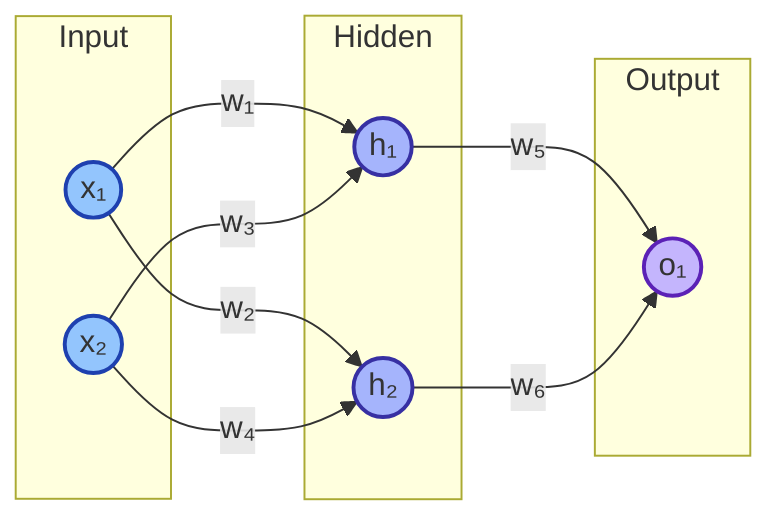
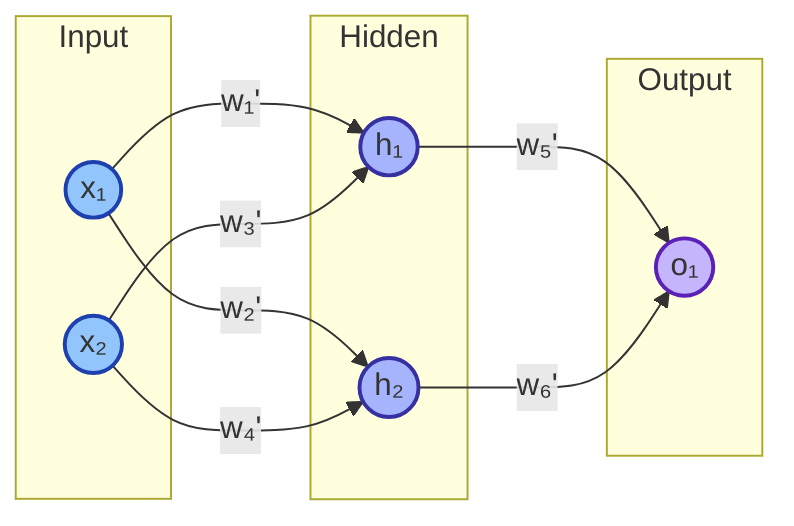

# backpropagation

## 등장 배경

- **1960-80년대 초**
    
    단일 퍼셉트론과 같은 얕은 신경망에 초점이 맞춰져 있었음
    
    다층 퍼셉트론과 같은 깊은 신경망의 학습은 역전파 알고리즘이 개발되기 전까지는 해결되기 어려운 문제
    
- **1986년**
    
    Geoffery Hinton, David Rumelhart, Ronald J. Williams 등이 역전파 알고리즘을 발표하여, 다층 퍼셉트론을 비롯한 깊은 신경망 학습이 가능해짐
    

## 필요성

* MNIST 데이터셋을 이용하여 숫자를 인식하는 신경망 모델

- 입력층 뉴런 784개
- 은닉층 뉴런 100개
- 출력층 뉴런 10개

* 계산량 

- **연결 가중치 개수**
  $$784 \times 100 + 100 \times 10 = 79,400$$
- **편향 개수**
  $$100 + 10 = 110$$
- **한 개의 이미지 손실 계산**
  $$79,400 \, \text{번의 연산량} \, (\text{가중치만 고려})$$
- **한 개의 파라미터를 업데이트 하기 위한 연산 횟수**:
  $$79,400 \times 60,000 = 4,764,000,000$$
- **모든 파라미터를 업데이트**
  $$4,764,000,000 \times 79,511 = 378,790,404,000,000$$
- **CPU 처리 속도가 초당 8억 5천만 번**이라면
  $$\frac{378,790,404,000,000}{850,000,000} = 445,635 \, \text{초} \, (\approx 123 \, \text{시간})$$

따라서 **1 epoch**에 약 **123시간이 필요함**

## 역전파 과정

예시 신경망

- 입력층 뉴런 2개
- 은닉층 뉴런 2개
- 출력층 뉴런 1개
- 활성화 함수: sigmoid
- 손실 함수: mse
- 모든 가중치와 학습률은 랜덤 배치

### 1. 순전파 (Feedforward)

- 입력값 
  
  $$x_1$$, $$x_2$$

- 입력값과 연결 가중치의 곱을 합하여 은닉층으로 전달
  
  $$z_1 = x_1w_1 + x_2w_3$$

  $$z_2 = x_1w_2 + x_2w_4$$

- 은닉층에서 활성화 함수 적용
  
  $$h_1 = \sigma(z_1)$$

  $$h_2 = \sigma(z_2)$$

- 출력층으로 전달
  
  $$z_3 = h_1w_5 + h_2w_6$$

- 최종 출력값
  
  $$o_1 = \sigma(z_3)$$

### 2. 손실 계산

- 손실 함수 (Mean Squared Error)
  
  $$C = \frac{1}{n} \sum_{i=1}^{n} (y_i - \hat{y_i})^2  = \frac{1}{2}(y - o_1)^2$$

### 3. 역전파 (Backpropagation)

가중치 업데이트 공식

$$w := w - lr \cdot \nabla C$$

$$lr$$ 은 학습률(Learning Rate), $\nabla C$는 손실 함수 $$C$$에 대한 기울기

#### $w_5$에 대한 미분 

**chain rule** 적용 

$$\frac{\partial C}{\partial w_5} = \frac{\partial C}{\partial o_1} \cdot \frac{\partial o_1}{\partial z_3} \cdot \frac{\partial z_3}{\partial w_5}$$

1. $$\frac{\partial C}{\partial o_1}$$ 구하기
    
    $$C = \frac{1}{2}(y - o_1)^2$$
    
    이를 예측 값 $$ o_1 $$에 대해 미분
    
    $$\frac{\partial C}{\partial o_1} = -(y - o_1)$$
    
2. $$\frac{\partial o_1}{\partial z_3}$$  구하기
    
    시그모이드 함수 $$ \sigma(z_3) $$의 미분
    
    $$\frac{\partial o_1}{\partial z_3} = o_1(1 - o_1)$$
    
3. **$$ z_3 $$에 대한 $$ w_5 $$의 편미분**
    
    $$z_3 = h_1 w_5 + h_2 w_6$$
    
    따라서
    
    $$\frac{\partial z_3}{\partial w_5} = h_1$$
    
    최종적으로 $$ w_5 $$에 대한 손실 기울기
    
    $$\frac{\partial C}{\partial w_5} = -(y - o_1) \cdot o_1(1 - o_1) \cdot h_1$$
    

유사한 방식으로 $$ w_6 $$에 대한 미분을 구하면

$$\frac{\partial C}{\partial w_6} = -(y - o_1) \cdot o_1(1 - o_1) \cdot h_2$$

#### 다음 레이어 $$ w_1 $$에 대한 미분 계산

$$\frac{\partial C}{\partial w_1} = \frac{\partial C}{\partial h_1} \cdot \frac{\partial h_1}{\partial z_1} \cdot \frac{\partial z_1}{\partial w_1}$$

1. **손실 함수에 대한 $$ h_1 $$의 편미분**
    
    $$ h_1 $$이 $$ z_3 $$에 영향을 미치므로, 다음과 같이 미분
    
    $$\frac{\partial C}{\partial h_1} = \frac{\partial C}{\partial z_3} \cdot \frac{\partial z_3}{\partial h_1}$$
    
    이미 구한 $$ \frac{\partial C}{\partial z_3} $$는
    
    $$\frac{\partial C}{\partial z_3} = -(y - o_1) \cdot o_1(1 - o_1)$$
    
    따라서
    
    $$\frac{\partial C}{\partial h_1} = -(y - o_1) \cdot o_1(1 - o_1) \cdot w_5$$
    
2. **$$ h_1 $$에 대한 $$ z_1 $$의 편미분**
    
    $$ h_1 $$은 시그모이드 함수이므로
    
    $$\frac{\partial h_1}{\partial z_1} = h_1(1 - h_1)$$
    
3. **$$ z_1 $$에 대한 $$ w_1 $$의 편미분**
    
    $$ z_1 $$은 입력값과 가중치 $$ w_1 $$의 곱
    
    $$\frac{\partial z_1}{\partial w_1} = x_1$$
    

최종적으로 $$ w_1 $$에 대한 손실 기울기

$$\frac{\partial C}{\partial w_1} = -(y - o_1) \cdot o_1(1 - o_1) \cdot w_5 \cdot h_1(1 - h_1) \cdot x_1$$

위의 과정을 반복해서 각 가중치에 대한 손실 기울기를 계산하고, 가중치 업데이트

### References

- [https://www.youtube.com/watch?v=1Q_etC_GHHk](https://www.youtube.com/watch?v=1Q_etC_GHHk)
- [https://www.youtube.com/watch?v=DMCJ_GjBXwc](https://www.youtube.com/watch?v=DMCJ_GjBXwc)
