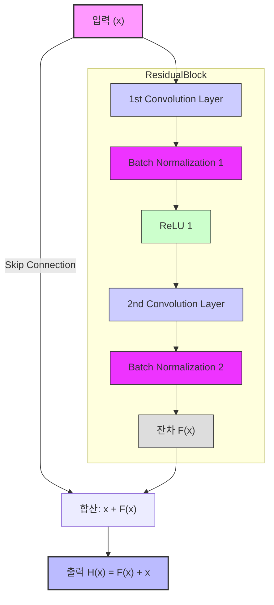

## ResNet이란?

- ResNet(Residual Network)은 딥러닝에서 깊은 네트워크를 안정적으로 학습할 수 있도록 설계됨
- 2015년 Microsoft Research에서 개발
- 딥러닝 모델이 깊어질수록 발생하는 **기울기 소실(Gradient Vanishing)** 문제와 **성능 저하(Performance Degradation)** 문제를 해결하기 위해 등장

### 기존 문제점

딥러닝 모델의 깊이 증가의 한계

- 딥러닝 모델의 깊이가 증가하면 학습 능력이 향상될 것으로 기대되지만, 실제로는 **기울기 소실(Gradient Vanishing), 성능 저하(Performance Degradation)**와 같은 문제가 발생

### ResNet 아이디어

- 기존 문제점을 해결하기 위해 네트워크가 깊어져도 학습 성능이 저하되지 않도록 **Residual Learning(잔차 학습)**을 도입
- 잔차 학습의 핵심 아이디어는 학습 대상 함수를 직접 모델링하는 대신, **입력과 출력의 차이(잔차, residual)**를 학습하는 것
- 이를 통해 모델이 학습해야 할 목표를 단순화하고, 복잡한 함수 대신 간단한 변화를 학습할 수 있어짐

### **Plain Network와 ResNet 비교**

```mermaid
graph TD
		subgraph "ResNet"
        B1["입력 (x)"] -->|"Skip Connection"| B2["첫 번째 Residual Block : F1(x)"]
        B1 --> B2
        B2 --> B3["출력: x + F1(x)"]
        
        B3 -->|"Skip Connection"| B4["두 번째 Residual Block F2(x)"]
        B3 --> B4
        B4 --> B5["출력: x + F1(x) + F2(x)"]
        
        B5 -->|"Skip Connection"| B6["세 번째 Residual Block F3(x)"]
        B5 --> B6
        B6 --> B7["최종 출력: x + F1(x) + F2(x) + F3(x)"]
        
        style B1 fill:#f9f,stroke:#333,stroke-width:2px
        style B7 fill:#bbf,stroke:#333,stroke-width:2px
        style B2 fill:#ccf,stroke:#333,stroke-width:1px
        style B4 fill:#ccf,stroke:#333,stroke-width:1px
        style B6 fill:#ccf,stroke:#333,stroke-width:1px
    end
    
    subgraph "Plain Network"
        A1["입력 (x)"] --> A2["변환 G1(x)"]
        A2 --> A3["변환 G2(G1(x))"]
        A3 --> A4["변환 G3(G2(G1(x)))"]
        A4 --> A5["출력 H(x)"]
        style A1 fill:#f9f,stroke:#333,stroke-width:2px
        style A5 fill:#bbf,stroke:#333,stroke-width:2px
    end
    

    classDef default fill:#f9f,stroke:#333,stroke-width:1px;
    
```

### 1. **Plain Network**

- 입력 $x$ 를 학습하여 복잡한 함수 $H(x)$를 직접 모델링해야 함
    
    $$
    H(x) = G(x, W)
    $$
    
    - $H(x)$: 레이어의 최종 출력
    - $G(x, W)$: 입력 데이터  $x$ 와 가중치  $W$ 를 기반으로 하는 복잡한 변환 함수
- 모든 층에서 새로운 변환을 학습해야 하므로, 네트워크가 깊어질수록 학습이 어려워지고 기울기 소실 문제가 발생하기 쉬움

### 2. **ResNet**

- 입력  $x$ 와 출력 $H(x)$의 차이, 즉 **잔차(residual)**만 학습하도록 설계
    
    $$
    F(x) = H(x) - x \quad \implies \quad H(x) = F(x) + x
    $$
    
    - $F(x)$  : Residual Mapping(잔차 함수), 학습해야 할 새로운 정보
    - $x$ : Skip Connection을 통해 전달된 입력
- 잔차 $F(x)$ 만 학습하면 되므로, 학습이 단순화되고 효율성이 높아짐
- 입력  $x$는 그대로 전달되어 네트워크 깊이가 깊어져도 기울기 소실 문제가 완화

### ResNet 효과

1. 깊은 네트워크 학습 가능
    
    잔차 학습을 통해 입력 데이터가 직접 다음 층으로 전달되므로, 1000개 이상의 층을 가진 네트워크에서도 안정적으로 학습이 가능해짐
    
2. 효율적 학습
    
    Residual Block 구조 덕분에 복잡한 목표를 직접 학습하지 않고, 기존 정보에 대한 차이만을 학습하여 효율적으로 계산 자원을 활용할 수 있음
    
3. ImageNet에서의 성과
    
    ResNet은 **ImageNet Large Scale Visual Recognition Challenge (ILSVRC)** 2015에서 우승하며 뛰어난 성능을 입증
    
    - **ResNet-34**: 5.71%의 에러율
    - **ResNet-152**: 3.57%의 에러율
    - 사람의 분류 기준인 5% 이상 효율 달성

### ResNet Model

## Residual Block과 Skip Connection

### **수식**

$$
H(x) = F(x) + x
$$

- $H(x)$ : 레이어의 최종 출력
- $F(x)$: 학습해야 할 Residual Mapping(잔차 함수)
- $x$ : 입력 데이터

### Residual Block(잔차 블록)

- 두 개의 3x3 합성곱(Convolution) 레이어
- 각 레이어마다 배치 정규화(Batch Normalization)와 ReLU 활성화 함수 적용
- Skip Connection을 통해 입력 직접 전달

#### 과정

1. **입력 변환**
입력 $x$ 는 첫 번째 Convolution 레이어를 통과하여 중간 표현 $F_1(x)$로 변환
2. **잔차 생성**
두 번째 Convolution 레이어에서 추가적인 변환 $F_2(F_1(x))$이 수행되어 최종 잔차 $F(x)$ 가 생성
3. **Skip Connection 합산**
Skip Connection을 통해  $F(x)$와  $x$ 가 합산되어 최종 출력 $H(x)$ 를 생성

### Skip Connection(스킵 연결)

- 입력 값을 그대로 다음 레이어로 전달하여 잔차  $F(x)$를 학습
- 즉, 네트워크의 한 층의 입력을 그 층의 출력에 직접 더하는 연산을 해줌

#### 특징

1. 입력 데이터가 두 경로로 흐름
    1. 변환 경로 (합성곱, 활성화 함수 등)
    2. 직접 연결 경로 (변형 없이 그대로 전달)
2. 두 경로의 출력을 요소별 합(element-wise sum)으로 결합

### Identity Shortcut vs Projection Shortcut

Skip Connection은 입력과 출력의 차원이 다를 때 두 가지 방식으로 구현

1. **Identity Shortcut**
    - 입력과 출력의 차원을 맞추기 위해 **zero-padding**을 추가
    - 간단한 구조로 계산량이 적고 효율적
2. **Projection Shortcut**
    - 1x1 Convolution 레이어를 사용해 입력의 차원을 출력과 동일하게 변환
    - 복잡한 변환이 필요할 때 사용

#### ResNet 논문의 실험

- ResNet 논문에서는 세 가지 네트워크를 비교
    1. **(A): zero-padding (Identity Shortcut)**
    2. **(B): Identity Shortcut (차원이 다른 경우만 Projection Shortcut 사용)**
    3. **(C): Projection Shortcut만 사용**
- 성능 비교
    - **(C)**: 가장 높은 성능
    - **(B)**: 다음으로 높은 성능
    - **(A)**: 가장 낮은 성능
- **원인 분석**
    - Identity Shortcut 방식에서는 zero-padding 영역에서 잔차 학습이 이루어지지 않아 성능이 떨어진 것으로 추정
    - 그러나 (A), (B), (C)의 차이가 크지 않았기 때문에 parameter가 증가하지 않는 (B) 방식을 주로 사용함

### Vanishing Gradient를 피하는 원리

- 계산 과정
    1. **Residual Block의 수식** 
        
        $$
        x_{l+1} = x_l + F(x_l, W_l)
        $$
        
    2. **일반화된 식**
        
        $$
        x_L = x_l + \sum_{i=l}^{L-1} F(x_i, W_i)
        $$
        
    3. **역전파 기울기 계산**
        
        $$
        \frac{\partial x_l}{\partial \epsilon} = \frac{\partial x_L}{\partial \epsilon} \cdot \left(1 + \frac{\partial}{\partial x_l} \sum_{i=l}^{L-1} F(x_i, W_i)\right)
        $$
        

- 핵심 분석
    1. 첫 번째 항 $\frac{\partial x_L}{\partial \epsilon}$
        - Skip Connection 덕분에 입력 신호가 직접적으로 전파
        - 기울기가 소실되지 않고 안정적으로 유지되므로, 깊은 네트워크에서도 학습이 가능
    2. 두 번째 항$\frac{\partial}{\partial x_l} \sum F(x_i, W_i)$
        - Weight layer를 거친 기울기 정보로, 잔차 $F(x)$에 의존
        - 이 값이 0이 되더라도, 첫 번째 항 덕분에 전체 기울기가 유지된다

## ResNet 의 개선 및 발전

### 1. Pre-Activation 구조

#### 기존 Post-Activation 구조

$$
\text{Conv → BN → ReLU → Skip Connection}
$$

- Skip Connection과 입력 신호가 합산된 후 **ReLU 활성 함수**를 통과하며, 이 과정에서 음의 값이 모두 소멸
- 네트워크가 깊어질수록 ReLU로 인해 음수 영역의 신호 손실이 누적되며, 이는 신호 왜곡과 최적화 어려움으로 이어질 수 있음

#### Pre-Activation 구조

$$
\text{BN → ReLU → Conv → Skip Connection}
$$

- **ReLU와 Batch Normalization**을 Convolution 연산 이전에 배치하여, Convolution 후 신호가 Skip Connection과 직접 합산되도록 설계
- 이로 인해 신호 손실 없이 잔차 $F(x)$를 학습하며, 활성 함수 $f$가 identity-mapping에 가까운 역할을 수행할 수 있음

#### 다양한 Residual Block 구조와 성능 비교

1. **(a) Post-Activation 구조**
    - 기존 ResNet에서 사용된 기본 구조
    - ReLU 활성화 함수가 Skip Connection 이후에 위치
2. **(b) Post-Batch Normalization**
    - Batch Normalization이 Skip Connection 이후로 이동
    - 성능이 기본 구조보다 저하됨 (CIFAR-10에서 error: 8.17%)
3. **(c) ReLU 내부 이동**
    - ReLU를 Convolution 내부로 이동시켜 양수 신호만 처리
    - 잔차 학습이 신호의 양수 편향으로 인해 성능이 저하
4. **(d) Partial Pre-Activation**
    - ReLU만 Convolution 연산 이전으로 이동
    - 성능이 약간 저하되나 기본 구조와 유사
5. **(e) Full Pre-Activation**
    - Batch Normalization과 ReLU를 모두 Convolution 연산 이전으로 이동
    - 가장 좋은 성능을 기록하며, CIFAR-10/100 및 ImageNet 데이터셋에서 높은 일반화 성능을 보임

#### 성능 분석

- **CIFAR-10/100 데이터셋 성능**
    - Pre-Activation 구조는 기본 구조에 비해 더 낮은 테스트 에러를 기록
    - **ResNet-164 (Full Pre-Activation):** 가장 낮은 테스트 에러 달성
    - Full Pre-Activation 구조는 신호가 Batch Normalization을 통과하면서 정규화되고, 일반화 성능이 향상됨

- **ImageNet 데이터셋 성능**
    - **ResNet-200**이 Pre-Activation 구조로 변경될 경우, 일반화 성능이 크게 향상됨
    - Post-Activation 구조에서는 ReLU로 인해 신호 손실이 발생하지만, Pre-Activation 구조에서는 이러한 문제가 해결됨

#### Pre-Activation 정리

- 활성 함수 $f$를 **identity-mapping**에 가깝게 만들어 학습을 더 쉽게 최적화하도록 설계된 새로운 Residual Block 구조
- **post-activation 구조**에서 발생할 수 있는 신호 손실 문제를 해결하고, 일반화 성능을 향상시키는 데 중점을 둔다
- 효과
    1. **Identity-Mapping 강화**
        - 활성 함수가 Convolution 연산 이전에 위치하면서, 네트워크가 초기 가정했던 $x_{l+1} = x_l + F(x_l)$ 관계를 더 잘 유지
    2. **정규화 효과**
        - Batch Normalization을 Convolution 이전에 배치하여 정규화된 신호가 잔차 학습에 도움을 줌
        - 일반화 성능 향상
    3. **신호 손실 방지**
        - ReLU로 인해 발생하는 음수 영역 신호 손실을 방지
        - 특히 네트워크 깊이가 깊어질수록 Pre-Activation 구조의 이점이 두드러짐
    

### 2. Bottleneck Design

#### Bottleneck Block의 구성

1. **1×1 Convolution (차원 축소)**
    - 입력의 채널 차원을 축소하여 계산량을 감소
    - 예: 입력 채널 수가 256인 경우, 64로 줄임
2. **3×3 Convolution (주요 연산 수행)**
    - 줄어든 채널 차원에서 합성곱 연산을 수행하여 효율성을 극대화
    - 계산량을 줄인 상태에서 이미지 특징을 학습
3. **1×1 Convolution (차원 복구)**
    - 다시 원래 채널 차원으로 복원하여 네트워크의 정보를 유지
    - 예: 64 채널을 256으로 확장

#### Bottleneck 구조를 활용한 더 깊은 ResNet 설계

1. **50-layer ResNet**

- **구조 변경**
    - 기존의 34-layer ResNet에서 Residual Block을 Bottleneck Block으로 변경하여 설계.
    - 네트워크의 Flops(Floating Point Operations)는 약 **38억**으로, 기존 대비 계산 효율성을 극대화.
- **Projection Shortcut 사용**
    - 차원이 바뀌는 순간의 Shortcut에는 **Projection Shortcut**을 사용
    - 나머지 영역에는 계산량 절감을 위해 **Identity Shortcut**을 사용

2. **101-layer 및 152-layer ResNet**

- **확장 설계**
    - 50-layer 구조를 확장하여 101-layer와 152-layer를 설계
    - **101-layer Flops**: 약 **76억**
    - **152-layer Flops**: 약 **113억**
    - 여전히 VGGNet(15.3/19.6 billion Flops)보다 계산량이 적으며, 더 깊은 네트워크를 효율적으로 학습 가능

#### Bottleneck 정리

- 깊은 네트워크의 계산 효율성을 높이기 위해 도입
- 네트워크의 파라미터 수를 줄이는 동시에 성능을 유지하거나 향상 가능
- 효과
    1. **계산 효율성**
        - 더 깊은 네트워크 설계에서도 계산량 증가를 최소화
        - Flops를 줄이는 동시에 네트워크 표현력을 유지
    2. **성능 유지 및 향상**
        - 깊이가 증가함에 따라 성능이 꾸준히 개선
        - 더 큰 데이터셋(ImageNet 등)에서 뛰어난 일반화 성능
    3. **Degradation Problem 해결**
        - 잔차 학습과 Bottleneck 구조의 결합으로 매우 깊은 네트워크에서도 학습 성능이 안정적으로 유지

### 3. Ensembles(앙상블) 적용

#### 단독(single) 모델 성능

- ResNet-50: **Top-5 Error 6.71%**
- ResNet-101: **Top-5 Error 5.60%**
- ResNet-152: **Top-5 Error 5.25%**

#### 앙상블(ensemble) 성능

- 여러 ResNet 모델을 앙상블한 결과, **Top-5 Error 3.57%**로 당시 ImageNet Large Scale Visual Recognition Challenge(ILSVRC)에서 최고의 성능을 달성

### 3. Wider and Deeper Variants

- ResNet의 개념을 확장한 변형 모델들은 효율성과 성능을 더욱 향상
    1. **ResNeXt**: 그룹화된 Convolution을 도입하여 효율성을 극대화
    2. **Wide ResNet**: 네트워크의 폭을 늘려 더 강력한 표현 학습을 가능하게 함

### 4. 정규화 기법의 활용

- ResNet 구조는 과적합을 방지하고 학습 안정성을 높이기 위해 다양한 정규화 기법을 활용
    1. **Dropout**: 일부 뉴런을 무작위로 제거하여 일반화 성능 향상
    2. **Stochastic Depth**: Residual Block을 무작위로 건너뛰는 방식으로 더 깊은 네트워크에서도 효율적인 학습이 가능하도록 설계

## 정리

- **기울기 흐름 개선**
    - 깊은 네트워크에서도 기울기 소실 문제가 발생하지 않도록 설계
    - 안정적인 학습을 보장하며 Degradation Problem을 해결
- **효율적 학습**
    - 잔차만 학습하도록 설계하여 학습 목표를 단순화
    - 계산량 증가를 최소화하며 깊은 네트워크에서도 높은 성능 유지
- **정보 보존**
    - 원본 입력 정보의 일부를 항상 보존
    - 작은 변화만 학습하므로 과도한 정보 왜곡 방지
- **범용성**
    - ResNet은 다양한 데이터셋과 도메인(CIFAR, ImageNet, Object Detection)에서 성능을 입증
    - 이후 많은 변형 모델(ResNeXt, Wide ResNet, DenseNet 등)의 기반이 됨
