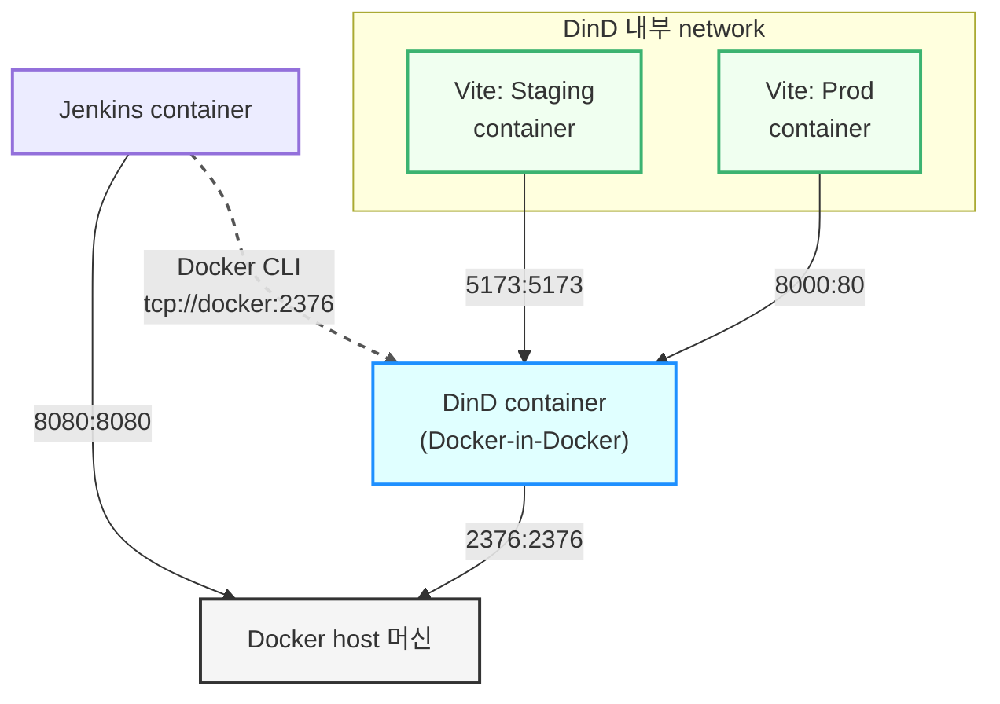
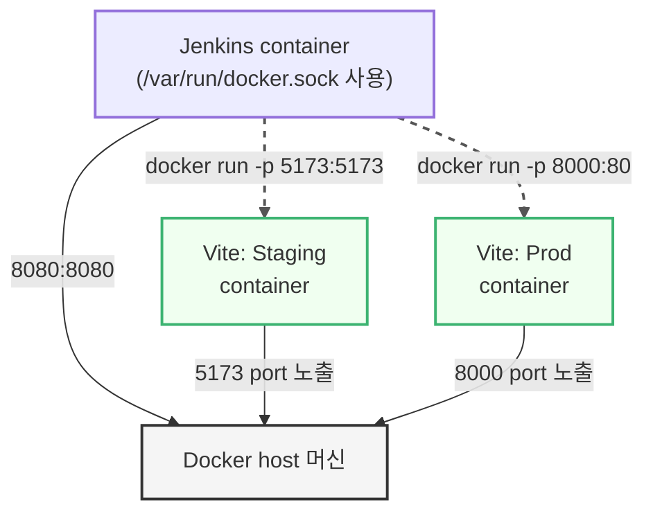

> Window11 환경에서 진행하였다
> 
> 
> Linux, Mac에서 Docker run 명령어는 [Jenkins Handbook](https://www.jenkins.io/doc/book/installing/docker/) 참고
{: .prompt-warning}


## **배포용 프로젝트 설정**

### **앱 생성**

```bash
npm create vite@latest my-app -- --template react
cd my-app
npm install
```

### **앱 실행 확인**

```bash
npm run dev 
```


### **Dockerfile 생성**

```docker
# base image
FROM node:20

# app directory
WORKDIR /app

# install deps
COPY package*.json ./
RUN npm install

# copy source
COPY . .

# build app
RUN npm run build

# install lightweight HTTP server for static files
RUN npm install -g serve

# expose port
EXPOSE 80

# start app
CMD ["serve", "-s", "dist", "-l", "80"]

```

### **Jenkinsfile 생성**

```groovy
pipeline {
    agent any

    environment {
        IMAGE_NAME = "my-vite-app"
        IMAGE_TAG = "latest"
    }

    stages {
        stage('Build Docker Image') {
            steps {
                script {
                    sh "docker build -t ${IMAGE_NAME}:${IMAGE_TAG} ."
                }
            }
        }

        stage('Run Container (Staging)') {
            steps {
                sh """
                docker rm -f vite-staging || true
                docker run -d --name vite-staging -p 5173:5173 ${IMAGE_NAME}:${IMAGE_TAG}
                """
            }
        }

        stage('Sanity Check') {
            steps {
                input "✅ 확인되셨으면 'Continue'를 눌러 주세요."
            }
        }

        stage('Run Container (Production)') {
            steps {
                sh """
                docker rm -f vite-prod || true
                docker run -d --name vite-prod -p 8000:80 ${IMAGE_NAME}:${IMAGE_TAG}
                """
            }
        }
    }

    post {
        always {
            echo "✅ 파이프라인 종료됨"
        }
    }
}
```

### **Github Repo 구조**


## **DinD(Docker in Docker)**

### **Jenkins 환경 구성**

1. **Jenkins Container**와 **Docker deamon Container**간의 통신을 위해 **Docker network**를 설정해 준다
    
    ```bash
    docker network create jenkins
    ```
    

2. **Jenkins Container 안에서 Docker 명령을 실행하기 위해** docker:dind 이미지를 다운로드하고 실행한다
    
    ```bash
    docker run --name jenkins-docker --rm --detach ^
      --privileged --network jenkins --network-alias docker ^
      --env DOCKER_TLS_CERTDIR=/certs ^
      --volume jenkins-docker-certs:/certs/client ^
      --volume jenkins-data:/var/jenkins_home ^
      --publish 2376:2376 ^
      docker:dind
    ```
    
    - `-privileged` : dind가 제대로 작동하기 위해 권한 설정
    - `-volume jenkins-docker-certs:/certs/client` : TLS 인증서를 위한 볼륨 mount
    - `-volume jenkins-data:/var/jenkins_home` : Jenkins 데이터를 위한 볼륨 mount
  
3. 공식 Jenkins 이미지를 기반으로 **Docker CLI를 추가한 Dockerfile을** 만든다
    
    ```docker
    FROM jenkins/jenkins:lts
    
    USER root
    
    RUN apt-get update && apt-get install -y lsb-release
    
    RUN curl -fsSLo /usr/share/keyrings/docker-archive-keyring.asc \
      https://download.docker.com/linux/debian/gpg
      
    RUN echo "deb [arch=$(dpkg --print-architecture) \
      signed-by=/usr/share/keyrings/docker-archive-keyring.asc] \
      https://download.docker.com/linux/debian \
      $(lsb_release -cs) stable" > /etc/apt/sources.list.d/docker.list
      
    RUN apt-get update && apt-get install -y docker-ce-cli
    
    USER jenkins
    ```
    
4. Dockerfile을 기반으로 **`myjenkins`** 라는 이름으로 Docker 이미지를 빌드하고 실행한다
    
    ```docker
    docker build -t myjenkins .
    ```
    
    ```docker
    docker run --name jenkins --restart=on-failure --detach ^
      --network jenkins --env DOCKER_HOST=tcp://docker:2376 ^
      --env DOCKER_CERT_PATH=/certs/client --env DOCKER_TLS_VERIFY=1 ^
      --volume jenkins-data:/var/jenkins_home ^
      --volume jenkins-docker-certs:/certs/client:ro ^
      --publish 8080:8080 --publish 50000:50000 myjenkins
    ```
    

Docker Container 실행 모습


### **Github Pipeline 수행 결과**

작업이 성공적으로 수행된 것을 확인할 수 있다


**But, `http://localhost:8000/` 를 통해 Vite 앱에 연결할 수 없었다**


### **Docker Container 확인**

- **host**
    
    
    
- **Jenkins Container**
    
    
    
- **Dind Container**
    
    
    

Jenkins container, DinD container 내부에서 `docker ps` 를 실행했을 때 `vite-prod` 와 `vite-staging` container를 확인할 수 있다

이는 두 container 모두 **DinD container가 관리하는 Docker 환경 내에서 실행**되고 있기 때문이다

### **Dind 작동 파악**

1. **Host -> Jenkins container**
    - `docker run ... --publish 8080:8080 myjenkins`: Host의 8080 port와 Jenkins container의 8080 port가 연결되어 있음
2. **Host -> DinD container**
    - `docker run ... --publish 2376:2376 docker:dind`: Host의 2376 port와 DinD container의 2376 port가 연결되어 있음
    - 이 port는 Jenkins가 DinD에게 Docker 명령을 내리기 위해 사용된다
3. **Jenkins Pipeline 내 Docker 실행**
    - Jenkinsfile 내부에서 docker 명령어 실행
        - `docker run -d --name vite-staging -p 5173:5173 ...`
        - `docker run -d --name vite-prod -p 8000:80 ...`
    - 이 명령어들은 Jenkins container(`myjenkins`) 내부에서 실행되지만, `DOCKER_HOST=tcp://docker:2376` 환경 변수 때문에 실제로는 DinD container(`jenkins-docker`)에게 전달되어 실행됨
    - 즉, `p 5173:5173`과 `p 8000:80` 옵션은 **DinD container의 port**와 **Vite 앱 container의 port**를 연결하게 된다
        - DinD container의 5173번 port가 `vite-staging` container의 5173번 port로 연결
        - DinD container의 8000번 port가 `vite-prod` container의 80번 port로 연결
4. **결론**
    - Host PC에서 `localhost:8000` 이나 `localhost:5173` 으로 접속하려고 하면, Host PC는 해당 port를 리스닝하는 프로세스를 찾지 못한다
    - 왜냐면, Vite 앱 container의 port와 연결된 것은 **DinD container의 port**이지, **Host PC의 port**가 아니기 때문이다
    - DinD container는 Host PC에 오직 `2376` port만 노출하고 있다



### **문제 요약**

- Jenkins와 Docker는 서로 **bridge된 가상 network(jenkins)** 위에서 동작하고 있음
- Jenkins 내부에서 실행된 container(vite-staging, vite-prod)는 **외부(host PC)**에서 직접 접근할 수 없음
- 현재 `vite-prod`, `vite-staging` container는 Jenkins 내부에서 실행 → **host에서의 port 포워딩이 없음**

### **해결법**

1. **`--network host` 적용**
    
    ```bash
    docker run --network host ...
    ```
    
    - Jenkinsfile에서 바로 host와 같은 network로 붙일 수 있다
    - **하지만,** Linux에서만 지원되고 Window Docker Desktop에서는 사용할 수 없다고 한다
2. **Nginx Reverse Proxy**
    - port를 외부에 노출하지 않고, Jenkins container에 Nginx 같은 Reverse Proxy를 붙여서 Vite container에 Proxy 구성을 할 수 있다
    - 구성이 복잡하지만 CI/CD 중 실서비스처럼 접근 가능하게 할 수 있는 방법
    - **구성 방법**
        - Jenkins container는 `localhost:8080`으로 열려 있음
        - Nginx도 Jenkins container에서 실행 중
        - `localhost:5173 → Nginx → DinD 내부의 vite-staging Container`로 proxy 구성
3. **DinD Container port 노출**
    - DinD Container에서 사용할 port를 미리 `--publish 8000:8000`, `--publish 5173:5173`를 이용해 열어둔다
        - Host:8000 -> DinD:8000 -> vite-prod:80
        - Host:5173 -> DinD:5173 -> vite-staging:5173
    
    ```shell
    docker run --name jenkins-docker --rm --detach ^
      --privileged --network jenkins --network-alias docker ^
      --env DOCKER_TLS_CERTDIR=/certs ^
      --volume jenkins-docker-certs:/certs/client ^
      --volume jenkins-data:/var/jenkins_home ^
      --publish 2376:2376 ^
      --publish 8000:8000 ^
      --publish 5173:5173 ^
      docker:dind
    ```
    

### **결과**

**DinD Container port 노출** 방법을 적용해서 DinD Container를 재실행한다음 Jenkins에서 다시 빌드하여 Vite 화면을 정상적으로 확인 가능했다


## **DooD(Docker-outside-of-Docker)**

### **Jenkins 환경 구성**

- 윈도우 환경에서 `/var/run/docker.sock` volume mount를 위해 **docker compose를 이용**하였다

1. 공식 Jenkins 이미지를 기반으로 Docker CLI를 추가한 Dockerfile을 만든다
    
    ```docker
    FROM jenkins/jenkins:lts
    
    USER root
    
    RUN apt-get update && \
        apt-get install -y curl gnupg2 lsb-release && \
        curl -fsSL https://download.docker.com/linux/debian/gpg | gpg --dearmor -o /usr/share/keyrings/docker-archive-keyring.gpg && \
        echo "deb [arch=$(dpkg --print-architecture) signed-by=/usr/share/keyrings/docker-archive-keyring.gpg] \
        https://download.docker.com/linux/debian $(lsb_release -cs) stable" > /etc/apt/sources.list.d/docker.list && \
        apt-get update && \
        apt-get install -y docker-ce-cli
    
    USER jenkins
    ```
    
2. `/var/run/docker.sock` volume mount를 위한 docker compose를 만든다
    
    ```yaml
    services:
      jenkins: 
        build:
          context: .
          dockerfile: Dockerfile
        user: root
        container_name: jenkins
        ports:
          - 8080:8080
          - 50000:50000
        volumes:
          - ./jenkins_home:/var/jenkins_home
          - /var/run/docker.sock:/var/run/docker.sock
        environment:
          - TZ=Asia/Seoul
    ```
    
    - `/var/run/docker.sock:/var/run/docker.sock`: docker.sock 파일을 container에 mount시켜서 docker 명령을 실행할 수 있게 한다
3. docker container 생성
    
    ```docker
    docker compose up -d
    ```
    

Docker Container 실행 모습


### **Github Pipeline 수행 결과**

작업이 성공적으로 수행된 것을 확인할 수 있다


`localhost:8000` 경로로 들어가면 Vite 화면을 확인 가능하다


### **Docker Container 확인**

- **host**
    
    
    
- Jenkins Container
    
    
    

host 와 Jenkins 에서 생성된 Vite Container 를 확인할 수 있다


### **DooD 작동 파악**

1. **Host -> Jenkins container**
    - `docker run -v /var/run/docker.sock:/var/run/docker.sock ... myjenkins`: Jenkins container는 host의 Docker daemon에 직접 접근할 수 있도록 설정됨 (`docker.sock` 공유)
    - Jenkins UI는 Host의 8080 port로 노출됨 (`p 8080:8080`)
2. **Jenkins Pipeline 내 Docker 실행**
    - Jenkinsfile 내부에서 실행되는 `docker run ...` 명령어는 Jenkins container 내에서 실행되지만,
    - 실제로는 **host Docker daemon**에 명령을 내리기 때문에 container는 **host network에서 직접 구동**됨
    - 따라서:
        - `p 5173:5173`은 Host의 5173 port를 Vite Staging container의 5173 port에 binding
        - `p 8000:80`은 Host의 8000 port를 Vite Prod container의 80 port에 binding
3. **결론**
    - Host PC에서 `localhost:8000`, `localhost:5173` 접속 시, 정상적으로 Vite 앱이 동작함
    - 이는 Jenkins가 명령을 실행하지만, **실제로는 Host가 직접 container를 구동하기 때문**임



## **DinD vs DooD 비교**

| 항목                   | DinD (Docker-in-Docker)                                                                                                       | DooD (Docker-outside-of-Docker)                                                                                            |
| ---------------------- | ----------------------------------------------------------------------------------------------------------------------------- | -------------------------------------------------------------------------------------------------------------------------- |
| **구성 방식**          | container 내부에 Docker 엔진과 CLI가 모두 포함되어 있어, 별도의 host socket 없이 자체 daemon을 구동함                         | host의 Docker daemon(`/var/run/docker.sock`)을 container에 mount하여, container 내부에서 직접 host daemon에 명령을 전달함  |
| **network 노출**       | 내부 DinD container network에만 port가 binding되어, host와 직접 port 포워딩이 필요함                                          | host network 레벨에서 port가 binding되므로, 추가 network 설정 없이 `-p` 옵션만으로 바로 접근 가능                          |
| **보안**               | 별도의 권한(`--privileged`)이 필요하며, 멀티 daemon이 중첩되면서 권한 확대 및 격리 우회 위험이 있음                           | host socket mount는 host 전체 권한을 container에 부여하므로, 최소 권한 원칙 위반 위험이 큼                                 |
| **성능**               | 각 DinD daemon이 추가 리소스(CPU/메모리/디스크)를 사용하여, 대규모 병렬 빌드시 성능 저하 및 디스크 중복 문제가 발생할 수 있음 | 별도 daemon이 없으므로 리소스 오버헤드가 적으며, host 캐시를 직접 활용할 수 있어 빌드 속도가 빠름                          |
| **빌드 캐시 공유**     | Inner/outer daemon 간 캐시 공유가 불가능해, 빌드 재시작 시 전체 레이어를 다시 다운로드해야 함                                 | host daemon 캐시를 그대로 사용하므로, Jenkins 재시작 후에도 캐시를 재활용할 수 있음                                        |
| **유지 보수**          | DinD 이미지 업데이트 및 TLS 설정이 필요하며, 인증서 경로 관리(`DOCKER_TLS_CERTDIR`) 등 추가 설정 부담이 있음                  | 단순히 Docker CLI만 있고, host daemon 관리로 일원화되어 설정과 모니터링이 용이함                                           |
| **추천 사용 시나리오** | 완전히 격리된 테스트 환경이 필요하거나, host 권한 공유가 반드시 차단되어야 할 때(예: container 개발용)                        | 일반적인 CI/CD 파이프라인에서 빠른 빌드와 쉬운 접근성을 중시할 때, 특히 Windows나 Mac 환경에서 host network 제약이 있을 때 |

---

### **요약**

- **DinD**는 **완전 격리**와 독립된 daemon 구동이 장점이지만, **성능**과 **보안** 측면에서 오버헤드와 취약점이 존재
    - [DevOps](https://devops.stackexchange.com/questions/676/why-is-docker-in-docker-considered-bad?utm_source=chatgpt.com), [Stack](https://devops.stackexchange.com/questions/676/why-is-docker-in-docker-considered-bad?utm_source=chatgpt.com), [Exchange](https://devops.stackexchange.com/questions/676/why-is-docker-in-docker-considered-bad?utm_source=chatgpt.com), [Medium](https://medium.com/%40parameshwarbhat411/docker-in-docker-the-good-and-the-bad-48cfe4e0da6e?utm_source=chatgpt.com)
- **DooD**는 **host 자원 재활용**, **간편한 네트워킹**, **빠른 빌드 속도**가 강점이지만, **socket mount로 인한 권한 노출** 리스크 존재
    - [레딧,](https://www.reddit.com/r/docker/comments/190i8m5/any_specific_security_concerns_when_running/?utm_source=chatgpt.com) [GitHub](https://github.com/docker-library/docker/issues/116?utm_source=chatgpt.com)
- 소규모 프로젝트나 테스트 전용 환경에서는 DinD, **실제 CI/CD 빌드 파이프라인**에는 DooD를 주로 권장
    - [Medium](https://medium.com/stackryze/docker-in-docker-vs-docker-out-docker-when-to-use-which-for-your-containerized-workflows-21e20f3df75e?utm_source=chatgpt.com)

## Reference

1. [https://ssnotebook.tistory.com/entry/Docker-Dind-Docker-in-docker-DoodDocker-out-of-docker](https://ssnotebook.tistory.com/entry/Docker-Dind-Docker-in-docker-DoodDocker-out-of-docker)
2. [https://docs.docker.com/engine/network/drivers/host/#docker-desktop](https://docs.docker.com/engine/network/drivers/host/#docker-desktop)
3. [https://blog.naver.com/islove8587/223460991164?trackingCode=rss](https://blog.naver.com/islove8587/223460991164?trackingCode=rss)